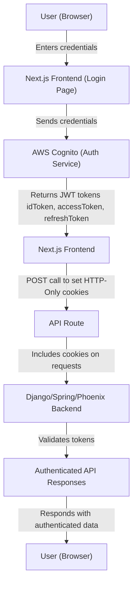

# Authentication Flow

```mermaid
graph TD
    A["User (Browser)"] -- Enters credentials --> B["Next.js Frontend (Login Page)"]
    B -- Sends credentials --> C["AWS Cognito (Auth Service)"]
    C -- Returns JWT tokens idToken, accessToken, refreshToken --> D["Next.js Frontend"]
    D -- "POST call to set HTTP-Only cookies" --> E["API Route"]
    E -- Includes cookies on requests --> F["Django/Spring/Phoenix Backend"]
    F -- Validates tokens --> G["Authenticated API Responses"]
    G -- Responds with authenticated data --> H["User (Browser)"]
```
